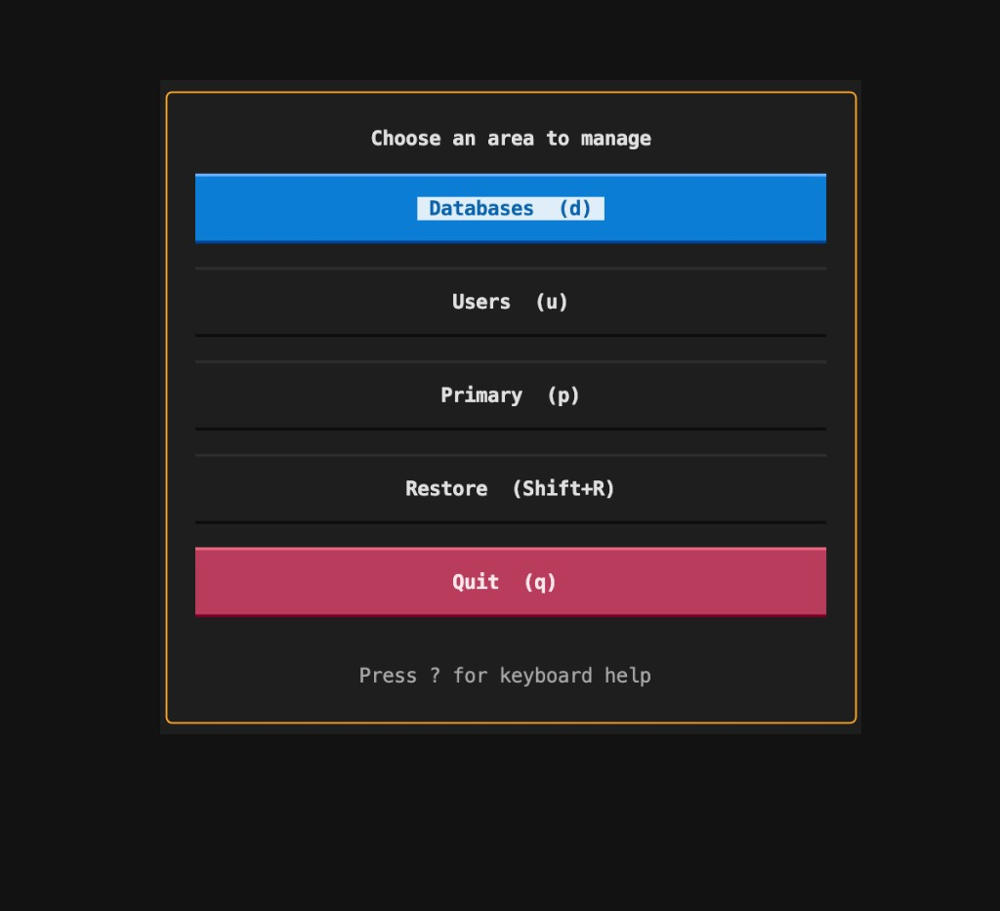
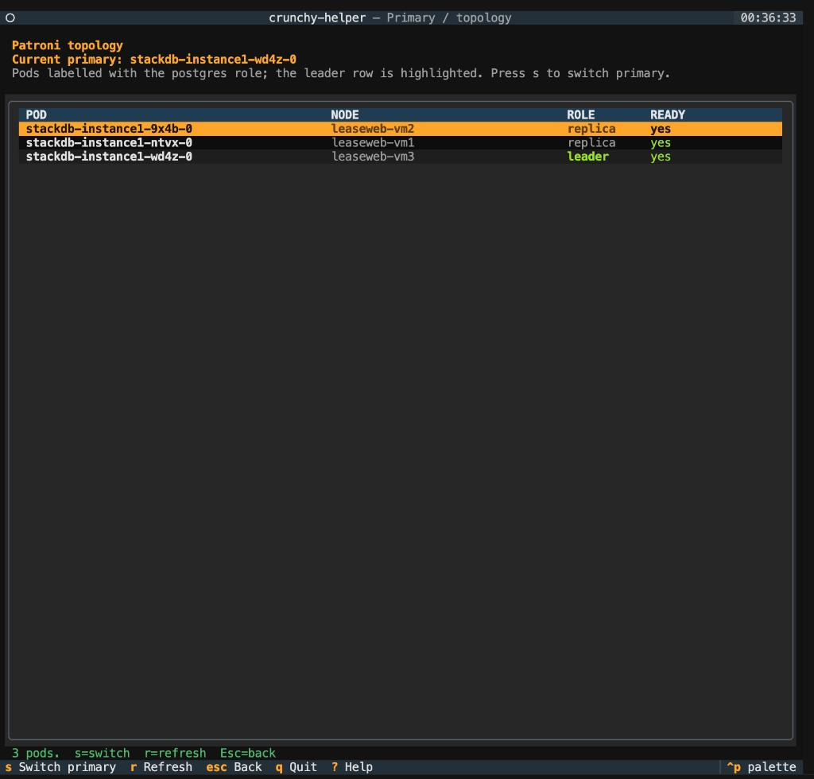

# crunchy-helper

A community-built CLI/TUI for managing databases on a **Crunchy PGO**
PostgreSQL cluster: list, create, delete, restore from pgBackRest,
manage users, and switch the Patroni primary — from either an
interactive terminal UI or a scriptable command line.

> **Not affiliated with [Crunchy Data](https://www.crunchydata.com/).**
> This is an unofficial third-party tool built on top of their excellent
> open-source [Postgres Operator (PGO)](https://github.com/CrunchyData/postgres-operator).

**[github.com/stackblaze/crunchy-helper](https://github.com/stackblaze/crunchy-helper)**
&nbsp;·&nbsp;
[](LICENSE)

<p align="center">
  
  &nbsp;
  
</p>

## Prerequisites

Python 3.7+, `kubectl` in `PATH` (pointing at the cluster that runs
PGO), and `psql` (auto-installed on Debian/Ubuntu by the bootstrap).

## Quick start

```bash
git clone https://github.com/stackblaze/crunchy-helper.git
cd crunchy-helper
pip install -r requirements.txt

./manager.py             # interactive TUI (recommended)
./manager.py list        # CLI: setup runs automatically if not configured
./manager.py users list
```

Setup explicitly: `python -m crunchy_helper.setup`

### Install on `$PATH` (optional)

So you can type `crunchy-helper` from anywhere instead of `./manager.py`:

```bash
sudo ./manager.py install              # /usr/local/bin/crunchy-helper
./manager.py install --user            # ~/.local/bin/crunchy-helper (no sudo)
./manager.py install --name ch         # custom command name
./manager.py install --force           # overwrite an existing symlink
```

The installer creates a symlink that points at the project, so
`git pull` upgrades the installed command in place — nothing to
re-install. If the install dir isn't on your `$PATH`, the command
prints the exact `export PATH=...` line to add to your shell rc.

## Two ways to run it

### Interactive TUI (no arguments)

Running `./manager.py` (or `crunchy-helper` once installed) with no
arguments launches a [Textual](https://textual.textualize.io/)-based
terminal UI:

- **Main menu** with quick access to Databases, Users, Primary, and Restore.
- **Tables with live counts**, owner / role colouring, and row-level
  actions (info, delete, reset password, switchover, …).
- **ProgressPanel**: long-running operations (restore, switchover) stream
  their logs into a scrollable panel with a live progress bar instead of
  freezing the UI.
- **Restore flow** picks the *latest* pgBackRest backup by default, lists
  the databases that are actually inside the backup (not the live
  cluster), and lets you re-pull from S3 (`f`) or clean up the local PVC
  (`Shift+D`) when you're done.
- **Press `?` anywhere** for a context-sensitive keyboard reference. The
  bottom bar (`Footer`) also shows the bindings for the current screen.
- **Quit guard**: `q` during an in-progress operation pops a confirm
  dialog so you don't accidentally abandon a restore halfway through.
- **Global error handler**: an uncaught exception inside any screen is
  shown in a modal instead of taking the whole app down.

The TUI is meant to be runnable from anywhere (workstation, bastion,
laptop) — it doesn't require running on the primary node. Individual
destructive operations re-check primary-node access at the moment they
run.

### CLI (scriptable)

The CLI subcommands keep their plain-stdout behaviour and are safe to
use in cron jobs, CI, and shell scripts:

| Command | Description |
| --- | --- |
| `crunchy-helper list [--db NAME]` | List DBs; optional connection info for one |
| `crunchy-helper create [--db NAME] [--user USER] [--password PASS]` | Create DB + user |
| `crunchy-helper delete [--db NAME] [--yes]` | Delete a database |
| `crunchy-helper restore [--backup LABEL] [--source-db NAME] [--as NAME] [--yes]` | Restore from pgBackRest |
| `crunchy-helper users {list \| create \| delete \| reset-password}` | Manage users |
| `crunchy-helper primary [--show] [--to POD_OR_NODE] [--yes]` | Show Patroni topology / switch the leader |
| `crunchy-helper install [--user] [--name CMD] [--prefix DIR] [--force]` | Symlink the script into a `$PATH` dir |

## Portable use

Copy the project to another host (`scp -r crunchy-helper user@host:` or
`tar -czf crunchy-helper.tar.gz crunchy-helper`). On the new machine,
extract, run `pip install -r requirements.txt`, then run
`./manager.py` — setup will prompt for that cluster's kubeconfig / API.
Use separate copies or `CRUNCHY_HELPER_ENV` for multiple clusters.

## Config

- **crunchy-helper.env** — Generated by setup; holds `KUBECONFIG`,
  `PG_HOST`, `NAMESPACE`, `CLUSTER`. Editable; `${SCRIPT_DIR}` works
  when the folder is copied.
- **CRUNCHY_HELPER_ENV** — Optional; point to another env file.
- Legacy `pg-db-manager.env` and `PG_DB_MANAGER_ENV` are still honoured
  so existing installs keep working through the rename.

## Restore flow

PVC per `(database, backup date)` → restore pod (`pgbackrest` pulls from
S3 onto the PVC) → extract pod (`pg_dump` of the source DB into the
PVC) → copy dump to the primary and `pg_restore`.

- The `pgbouncer` schema is dropped on the target before the restore so
  pre-removal dumps replay cleanly on PG 16+ (harmless no-op on newer
  dumps where the schema is already absent).
- Extract pod creation is **idempotent** — re-running a restore with a
  half-finished extract pod will reattach instead of crashing.
- The TUI keeps a `BackupSession` alive while you're choosing source /
  target databases, so picking a different DB from the same backup
  doesn't re-download from S3.
- Need a fresh download? Hit `f` on the backup list. Want to free disk?
  Hit `Shift+D`.

## HA connection strings

`create` and `list` emit URIs/JDBC carrying libpq HA flags
(`target_session_attrs=read-write&connect_timeout=5&sslmode=require`).
Point `PG_HOST` at a DNS name with A records for **all** K3s node IPs
(Klipper ServiceLB exposes the `pg-<cluster>-ha` LoadBalancer on every
node) and clients will skip dead / non-primary hosts and land on
whichever pod Patroni currently leads. `pgbouncer-*` keys are no longer
written into `*-pguser-*` secrets.

## Primary management

The TUI's **Primary** screen shows the live Patroni topology and lets
you switch the leader (`s` on the selected pod). The same workflow is
available from the CLI:

```bash
crunchy-helper primary --show                       # just print topology
crunchy-helper primary                              # interactive: pick by number
crunchy-helper primary --to mia-pg-dallas --yes     # promote pod/node, no prompt
```

`--to` accepts a list-number, a pod name, or a Kubernetes node name.
Switchover runs `patronictl switchover --leader … --candidate …
--force` inside the database container and verifies from a third pod —
this avoids the brief 502 window on the freshly promoted / demoted
ones. It's the only command that does **not** require running on the
current primary node, by design (you usually want to move the leader
*off* the host you're on).

## Architecture

```
manager.py                    # entry point, argparse + TUI launch
crunchy_helper/
  config.py / setup.py        # env file + first-run setup
  kube.py                     # kubectl + crictl helpers
  cluster.py / data.py        # pure data fetchers
  db_commands.py              # CLI: list/create/delete
  user_commands.py            # CLI: users list/create/delete/reset-password
  primary_commands.py         # CLI: primary topology / switchover
  restore.py                  # CLI: restore from pgBackRest
  textual_app.py + .tcss      # Textual app shell + global stylesheet
  operations/                 # pure functions used by the TUI
    progress.py               #   ProgressReporter protocol + OperationResult
    switchover.py / restore.py
  widgets/
    progress_panel.py         # streaming-log + progress-bar widget
  screens/
    main_menu.py
    databases.py / db_create.py / db_info.py
    users.py / user_actions.py
    primary.py / switchover.py
    restore.py                # 4-screen restore flow
    _dialogs.py               # ResultModal, ConfirmModal, HelpModal, ErrorModal
    _runner.py / _table.py    # in-process command runner + table cell helpers
```

The CLI subcommands and the TUI share the same kube / data / operations
layers, so behaviour stays consistent across both surfaces.

## Development

Headless smoke tests live under `/tmp/m{1..5}_test.py` (one per
migration milestone). Run them with:

```bash
for n in 1 2 3 4 5; do
  PYTHONPATH=. python3 /tmp/m${n}_test.py || break
done
```

Each script drives the Textual app via `App.run_test()` so they run
without a TTY and exit non-zero on regression.

## Acknowledgements

Built on the foundations laid by the
[Crunchy Data Postgres Operator (PGO)](https://github.com/CrunchyData/postgres-operator),
[Patroni](https://github.com/zalando/patroni),
[pgBackRest](https://pgbackrest.org/), and
[Textual](https://textual.textualize.io/).
This project is an independent operator-experience layer on top of those
tools — all credit for the underlying clustering / backup / restore
machinery belongs to their respective authors.

## Licence

[MIT](LICENSE) — free to use, modify, and redistribute, with attribution.
No warranty; you run it on your cluster, you own the consequences.
